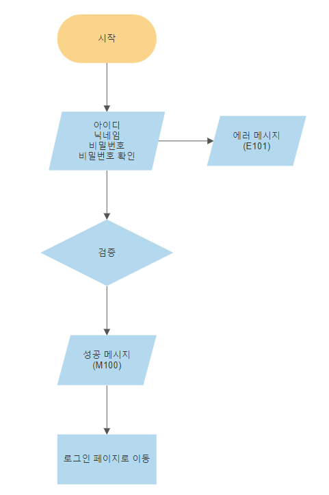

[TOC]

# 효율적인 알고리즘 설계와 순서도(Flowchart), 의사코드(pseudo-code) 작성

## 실습

### 알고리즘 디자인 설계

0. 회원가입 기능이 필요하다.

1. 외부로 부터 필요한 데이터 값 아이디, 비밀번호, 비밀번호 확인, 닉네임 4개를 입력 받는다.

   1-1. 전송 방식은 post로 json 타입으로 전해 받는다.

   1-2. 전송되는 객체 변수 값은 api 설계서에 변수 생성 규칙을 사용한다.

2. 1번에 데이터 값은 검증 조건이 필요하다.

​		2-1. 아이디와 닉네임에는 특수문자가 있으면 에러 (E101)을 리턴

​		2-2. 아이디와 닉네임, 비밀번호는 자릿수가 4자리 이상 12자리 이하 여야 함

​		2-3. 비밀번호에는 숫자 1개 이상 포함

​		2-4. 비밀번호에는 특수문자 중에 1개 이상이 포함

​		2-5. 비밀번호와 비밀번호 확인 값은 같아야 함

​		2-6. 상기 조건 중에 하나라도 해당되지 않으면 에러 (E101)을 리턴

3. 2번에 의한 데이터를 회원 테이블에 저장
4. 회원가입 성공
5. 성공 메시지 리턴
6. 로그인 페이지로 이동
7. 끝


### Flowchart 작성




### Pseudo-code 작성

```
function 문자열의 특수문자 포함 여부 검사
input 문자열
output 참 또는 거짓

function 문자열의 숫자 포함 여부 검사
input 문자열
output 참 또는 거짓

function 비밀번호와 비밀번호 확인 일치 검사
input 문자열
output 참 또는 거짓

start 회원가입
set 외부에서 받아온 데이터 값 아이디
set 외부에서 받아온 데이터 값 닉네임
set 외부에서 받아온 데이터 값 비밀번호
set 외부에서 받아온 데이터 값 비밀번호 확인
if (아이디는 특수문자가 포함 안됨
	and 닉네임은 특수문자가 포함 안됨
	and 아이디는 4자리 이상 12 자리 이하
	and 닉네임은 4자리 이상 12 자리 이하 
	and 비밀번호는 4자리 이상 12 자리 이하
	and 비밀번호는 숫자가 1개 이상
	and 비밀번호는 특수문자 1개 이상 포함
	비밀번호 확인은 비밀번호와 일치)
else
	return 에러 메시지 E101
	
return 성공 메시지 M100
end 로그인
```


## 정리
